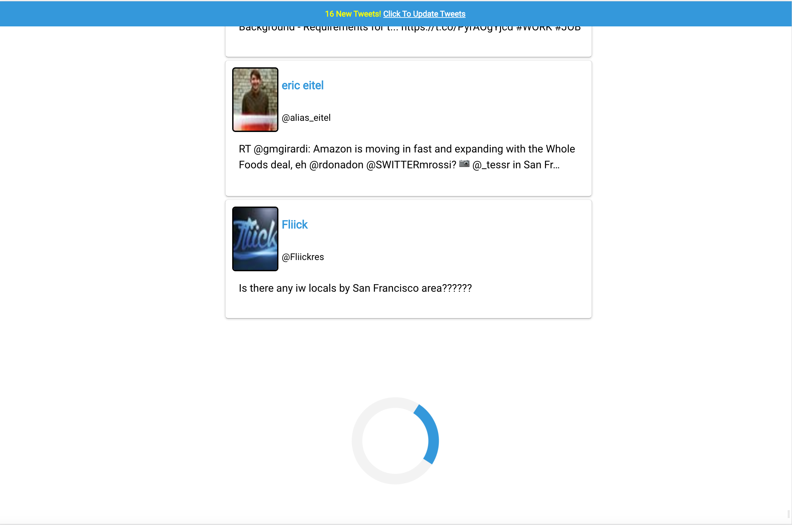

# Tweet Stream


## Table of Contents

1. [Owner](#owner)
1. [Usage](#usage)
1. [Requirements](#requirements)
1. [Development](#development)
    1. [Installing Dependencies](#installing-dependencies)
    1. [Tasks](#tasks)
    1. [Tech Stack](#tech-stack)
1. [Future](#future)

## Owner
  - [Sean O'Neal](https://github.com/sean-oneal)

## Usage
This application is built to provide a real-time stream of tweets that pertain to a specific hashtag.  The application features CSS Flexbox, infinity scroll and a custom loader.




## Requirements
- Node
- MongoDB
- Twitter API Keys

## Development

### Installing Dependencies

Install NPM modules in the **root** directory

```sh
npm install
```

Go to [Twitter for Developers](https://dev.twitter.com/) and follow the instructions on how to build a new app so that you will have the necessary API Keys to start the application.  After you have the required Twitter API Keys, create a '.env' file in the root directory and place them inside. An example of how this should look can be found in the '.sample-env' file.

Install MongoDB to local environment
Go to [MongoDB Installation Guide](https://docs.mongodb.com/manual/installation/)

### Tasks

Start the Express server and tell Webpack to watch files:

```sh
npm start
```

Start 'mongod' in another Terminal window or tab:


```sh
mongod
```

The default server will be running on [localhost:3000](localhost:3000).  To override the default Port, include a custom 'PORT' setting to the '.env' file.

Refresh the browser to see changes appear.

To Drop the Database:

```sh
npm run dropDb
```

### Tech Stack

This application was built using...
- React
- Express
- Socket.io
- Mongoose / MongoDB
- Webpack

## Future
- Sentiment analysis of Tweets
- D3 graphs for additional insights and analysis
- Historical analysis of tweets over time
